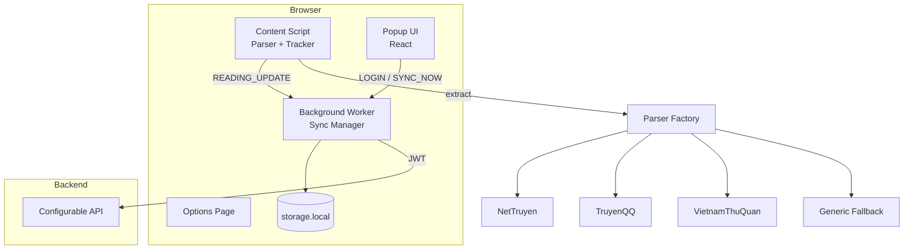

# Story Tracker

A production-ready browser extension that automatically detects and saves reading progress across novel, manga, and story websites. Built with TypeScript, Vite, React, and the WebExtensions API for maximum code sharing across Firefox, Chrome, and Edge.

## Architecture



### Project Structure

```
src/
  background/     # Service worker / background scripts, sync orchestration
  content/        # Page-level reading tracker
  popup/          # React popup dashboard
  options/        # Settings page
  parsers/        # Plugin-based site parsers
  services/       # API client, sync service
  storage/        # Persistence and offline queue
  auth/           # JWT authentication
  shared/         # Constants, message types
  hooks/          # React hooks for popup/options
  types/          # Shared TypeScript interfaces
  utils/          # Debounce, fingerprint, URL helpers
public/
  manifest/       # Per-browser manifests + host permissions config
```

## Features

- JWT authentication with auto-refresh
- Plugin-based parser system for multi-site support
- Scroll, visibility, and session tracking
- Debounced sync (every 30s, on tab blur, unload, chapter change)
- Offline queue with automatic retry
- Popup dashboard with reading progress and history
- Options page for site toggles, sync config, data export

## Setup

### Prerequisites

- Node.js 20+
- npm 10+

### Install

```bash
cd story-tracker
cp .env.example .env
npm install
node scripts/generate-icons.mjs
```

### Configure environment

Templates (synced with `frontend/.env.prod` and `backend/.env.prod`):

| File | Use |
|------|-----|
| `.env.example` | Local dev defaults |
| `.env.local.prod` | Local build → prod APIs (`npm run prepare-env local-prod`) |
| `.env.prod` | **Production / AMO release** (`npm run prepare-env prod`) |

```bash
npm run prepare-env prod    # .env.prod → .env (prod URLs baked into extension)
npm run release:prod        # prepare-env prod + build + zip all targets
```

Prod values (must stay aligned with FE/BE):

```env
PERSONAL_OS_FE_URL=https://personal-os-fe.fashandcurious.com   # frontend NEXT_PUBLIC_SITE_URL
AUTH_API_URL=https://api-auth.fashandcurious.com               # frontend API_URL
API_BASE_URL=https://api-personal-os.fashandcurious.com/api/v1 # backend APP_PUBLIC_URL + /api/v1
INTERNAL_APPLICATION_ID=personal-os-internal                   # frontend INTERNAL_APPLICATION_ID
COMMERCIAL_APPLICATION_ID=web                                  # frontend COMMERCIAL_APPLICATION_ID
```

All data API calls go to `API_BASE_URL` with `Authorization: Bearer <access_token>`.
Login/register/refresh go to fash-auth at `{AUTH_API_URL}/{AUTH_LOCALE}/api/v1/auth/*`.

### Configure Site Permissions

Edit `public/manifest/host-permissions.json` to add or remove supported websites without changing source code.

## Development

```bash
npm run dev          # Watch build (development mode)
npm run lint         # ESLint
npm run test         # Vitest unit tests
```

Load the extension in your browser:

- **Firefox**: `about:debugging` → This Firefox → Load Temporary Add-on → select `dist/firefox/manifest.json`
- **Chrome/Edge**: `chrome://extensions` → Developer mode → Load unpacked → select `dist/chrome/`

## Build

```bash
npm run build          # Build both browsers
npm run build:firefox  # dist/firefox/
npm run build:chrome   # dist/chrome/
```

## Browser Publishing

### Firefox (AMO)

1. Run `npm run build:firefox`
2. Run `npm run package:firefox` → `release/story-tracker-firefox.zip`
3. Submit at [addons.mozilla.org](https://addons.mozilla.org/developers/)
4. `browser_specific_settings.gecko.id` must match the **single** AMO listing for that add-on (`story-tracker@personal-os.local`)

**Duplicate add-on ID:** AMO allows each `gecko.id` on **one listing only**. Do not upload the same zip to a second listing (public + unlisted/self-test). Options:

| Goal | What to do |
|------|------------|
| New version of the same public add-on | Upload to the **existing** listing (Versions → Upload new version) |
| Personal / dev build on AMO (unlisted) | Use dev ID: `npm run build:firefox:dev && npm run package:firefox:dev` → `story-tracker-firefox-dev.zip` (`story-tracker-dev@personal-os.local`) — **new** AMO listing |
| Local test while public review pending | `about:debugging` → Load Temporary Add-on → `dist/firefox/manifest.json` (no AMO upload) |

Both public and dev builds can be installed side-by-side in Firefox (different IDs).

### Chrome Web Store

1. Run `npm run build:chrome`
2. Zip the `dist/chrome/` directory
3. Upload at [Chrome Developer Dashboard](https://chrome.google.com/webstore/devconsole)

### Microsoft Edge

1. Use `dist/chrome/` (Chromium-compatible)
2. Submit at [Partner Center](https://partner.microsoft.com/dashboard/microsoftedge/overview)

## Parser Development Guide

### 1. Create a parser class

```typescript
// src/parsers/mysite-parser.ts
import { BaseParser } from './base-parser';
import type { ReadingInfo } from '../types/reading';

export class MySiteParser extends BaseParser {
  readonly siteId = 'mysite';
  readonly priority = 100;

  canHandle(url: string): boolean {
    return /mysite\.com/i.test(url);
  }

  async extract(): Promise<ReadingInfo> {
    const storyTitle = this.getText('.story-title') ?? 'Unknown';
    const chapterTitle = this.getText('.chapter-title');
    return this.buildReadingInfo({ storyTitle, chapterTitle });
  }
}
```

### 2. Register in the factory

Add your factory function to `PARSER_FACTORIES` in `src/parsers/parser-factory.ts`.

### 3. Add host permission

Add the site's URL pattern to `public/manifest/host-permissions.json`.

### 4. Add site toggle (optional)

Add an entry to `SUPPORTED_SITES` in `src/shared/constants.ts`.

### Extraction Guidelines

- Never rely solely on URL structure
- Use `BaseParser` helpers: `getText`, `getMeta`, `getBreadcrumbTexts`, `getChapterFromNav`
- Prefer DOM selectors over URL parsing
- Use `buildReadingInfo()` for consistent fingerprinting

## API Integration Guide

### Authentication (Personal OS web — same as frontend)

Story Tracker does **not** collect credentials in the extension popup. Sign-in opens Personal OS web (`/extension/connect`), which supports:

| Mode | Flow (same as Personal OS FE) |
|------|-------------------------------|
| **Internal** | Admin Portal SSO → session handoff |
| **Commercial** | Google, email/password, or OTP |

After sign-in, tokens are passed to the extension via a secure handoff page. Configure `PERSONAL_OS_FE_URL` in `.env` (prod: `https://personal-os-fe.fashandcurious.com`).

### fash-auth-service (refresh / logout only)

| Method | Path | Body |
|--------|------|------|
| `POST` | `/{locale}/api/v1/auth/login` | `{ email, password, application_id }` |
| `POST` | `/{locale}/api/v1/auth/register` | `{ email, password, name, application_id }` |
| `POST` | `/{locale}/api/v1/auth/refresh` | `{ refresh_token, application_id }` |
| `POST` | `/{locale}/api/v1/auth/logout` | `{ refresh_token, application_id }` |

Response (`TokenResponse`):

```json
{
  "access_token": "eyJ...",
  "refresh_token": "eyJ...",
  "token_type": "bearer",
  "expires_in": 3600,
  "refresh_expires_in": 604800
}
```

**Internal login** requires JWT claim `admin` / `is_admin` / `isAdmin` = true.

### Personal OS API (Kong gateway)

All requests require `Authorization: Bearer <access_token>`.

Configurable paths (relative to `API_BASE_URL`):

#### `POST /reading-progress`

```json
{
  "storyId": "abc123",
  "storyTitle": "One Piece",
  "chapterId": "1000",
  "chapterTitle": "Chapter 1000",
  "currentUrl": "https://...",
  "progress": {
    "percentage": 75,
    "scrollY": 3200,
    "readingTimeSeconds": 180
  },
  "metadata": { "parser": "nettruyen" },
  "clientTimestamp": 1718700000000
}
```

#### `GET /reading-progress/current`

```json
// Response
{
  "items": [ /* ReadingProgressPayload[] */ ]
}
```

### API Client Features

- Configurable base URL and timeout
- Auth token injection via interceptor
- Retry with exponential backoff (5 attempts, 1s base delay)
- Skips retry on 401/403/4xx errors

## Permissions

| Permission | Purpose |
|------------|---------|
| `storage` | Persist auth, queue, history, settings |
| `activeTab` | Access current tab on user interaction (manual save) |
| Host permissions | Story sites + `api-personal-os` + `api-auth` domains |

**Privacy**: The extension never accesses browser history. Data is collected only from active pages where the extension has explicit host permission.

## Architecture Decision Records

- [ADR 001: Parser System](docs/adr/001-parser-system.md)
- [ADR 002: Authentication](docs/adr/002-authentication.md)
- [ADR 003: Storage Strategy](docs/adr/003-storage-strategy.md)

## Assumptions

1. Backend implements the configurable endpoint contracts above
2. Backend upserts reading progress by `storyId` + `chapterId`
3. JWT `expiresIn` is in seconds (defaults to 3600 if omitted)
4. Content scripts only run on hosts listed in `host-permissions.json`
5. Edge uses the Chrome build (Chromium WebExtensions)

## License

Private — part of Personal OS monorepo.
